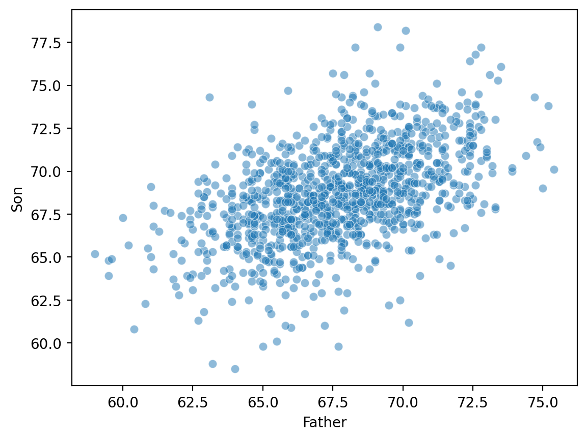

## Goals of this lecture

There are many ways to *describe* a distribution. 

Here we will discuss:
- Measurement of the relationship between distributions using **linear, rank correlations**.
- Measurement of the relationship between qualitative variables using **contingency**.

## Importing relevant libraries


```python
import numpy as np
import matplotlib.pyplot as plt
import seaborn as sns ### importing seaborn
import pandas as pd
import scipy.stats as ss
```


```python
%matplotlib inline 
%config InlineBackend.figure_format = 'retina'
```


```python
import pandas as pd
df_pokemon = pd.read_csv("data/pokemon.csv")
```

## Describing *bivariate* data with correlations

- So far, we've been focusing on *univariate data*: a single distribution.
- What if we want to describe how *two distributions* relate to each other?
   - For today, we'll focus on *continuous distributions*.

### Bivariate relationships: `height`

- A classic example of **continuous bivariate data** is the `height` of a `parent` and `child`.  
- [These data were famously collected by Karl Pearson](https://www.kaggle.com/datasets/abhilash04/fathersandsonheight).


```python
df_height = pd.read_csv("height.csv")
df_height.head(2)
```


<div>
<style scoped>
    .dataframe tbody tr th:only-of-type {
        vertical-align: middle;
    }

    .dataframe tbody tr th {
        vertical-align: top;
    }

    .dataframe thead th {
        text-align: right;
    }
</style>
<table border="1" class="dataframe">
  <thead>
    <tr style="text-align: right;">
      <th></th>
      <th>Father</th>
      <th>Son</th>
    </tr>
  </thead>
  <tbody>
    <tr>
      <th>0</th>
      <td>65.0</td>
      <td>59.8</td>
    </tr>
    <tr>
      <th>1</th>
      <td>63.3</td>
      <td>63.2</td>
    </tr>
  </tbody>
</table>
</div>


#### Plotting Pearson's height data


```python
sns.scatterplot(data = df_height, x = "Father", y = "Son", alpha = .5);
```


    

    


### Introducing linear correlations

> A **correlation coefficient** is a number between $[–1, 1]$ that describes the relationship between a pair of variables.

Specifically, **Pearson's correlation coefficient** (or Pearson's $r$) describes a (presumed) *linear* relationship.

Two key properties:

- **Sign**: whether a relationship is positive (+) or negative (–).  
- **Magnitude**: the strength of the linear relationship.

$$
r = \frac{ \sum_{i=1}^{n} (x_i - \bar{x})(y_i - \bar{y}) }{ \sqrt{ \sum_{i=1}^{n} (x_i - \bar{x})^2 } \sqrt{ \sum_{i=1}^{n} (y_i - \bar{y})^2 } }
$$

Where:
- $r$ - Pearson correlation coefficient
- $x_i$, $y_i$ - values of the variables
- $\bar{x}$, $\bar{y}$ - arithmetic means
- $n$ - number of observations

Pearson's correlation coefficient measures the strength and direction of the linear relationship between two continuous variables. Its value ranges from -1 to 1:
- 1 → perfect positive linear correlation
- 0 → no linear correlation
- -1 → perfect negative linear correlation

This coefficient does not tell about nonlinear correlations and is sensitive to outliers.

### Calculating Pearson's $r$ with `scipy`

`scipy.stats` has a function called `pearsonr`, which will calculate this relationship for you.

Returns two numbers:

- $r$: the correlation coefficent.  
- $p$: the **p-value** of this correlation coefficient, i.e., whether it's *significantly different* from `0`.


```python
ss.pearsonr(df_height['Father'], df_height['Son'])
```


    PearsonRResult(statistic=np.float64(0.5011626808075912), pvalue=np.float64(1.272927574366214e-69))


#### Check-in

Using `scipy.stats.pearsonr` (here, `ss.pearsonr`), calculate Pearson's $r$ for the relationship between the `Attack` and `Defense` of Pokemon.

- Is this relationship positive or negative?  
- How strong is this relationship?


```python
attack = df_pokemon['Attack']
defense = df_pokemon['Defense']
print(ss.pearsonr(attack, defense))

#relationship is positive and moderate 
sns.scatterplot(data = df_pokemon, x = "Attack", y = "Defense", alpha = .5);
```

    PearsonRResult(statistic=np.float64(0.4386870551184896), pvalue=np.float64(5.858479864289521e-39))
    


    

    


#### Solution


```python
ss.pearsonr(df_pokemon['Attack'], df_pokemon['Defense'])
```


    PearsonRResult(statistic=np.float64(0.4386870551184896), pvalue=np.float64(5.858479864289521e-39))


#### Check-in

Pearson'r $r$ measures the *linear correlation* between two variables. Can anyone think of potential limitations to this approach?

ANSWER: many variables are correlated but in non-linear way so sometimes it can be misleading 

### Limitations of Pearson's $r$

- Pearson's $r$ *presumes* a linear relationship and tries to quantify its strength and direction.  
- But many relationships are **non-linear**!  
- Unless we visualize our data, relying only on Pearson'r $r$ could mislead us.

#### Non-linear data where $r = 0$


```python
x = np.arange(1, 40)
y = np.sin(x)
p = sns.lineplot(x = x, y = y)
```


    

    


```python
### r is close to 0, despite there being a clear relationship!
ss.pearsonr(x, y)
```


    PearsonRResult(statistic=np.float64(-0.04067793461845843), pvalue=np.float64(0.8057827185936625))


#### When $r$ is invariant to the real relationship

All these datasets have roughly the same **correlation coefficient**.


```python
df_anscombe = sns.load_dataset("anscombe")
sns.relplot(data = df_anscombe, x = "x", y = "y", col = "dataset");
```


    

    


```python
# Compute correlation matrix
corr = df_pokemon.corr(numeric_only=True)

# Set up the matplotlib figure
plt.figure(figsize=(10, 8))

# Create a heatmap
sns.heatmap(corr, 
            annot=True,         # Show correlation coefficients
            fmt=".2f",          # Format for coefficients
            cmap="coolwarm",    # Color palette
            vmin=-1, vmax=1,    # Fixed scale
            square=True,        # Make cells square
            linewidths=0.5,     # Line width between cells
            cbar_kws={"shrink": .75})  # Colorbar shrink

# Title and layout
plt.title("Correlation Heatmap", fontsize=16)
plt.tight_layout()

# Show plot
plt.show()
```


    

    


## Rank Correlations

Rank correlations are measures of the strength and direction of a monotonic (increasing or decreasing) relationship between two variables. Instead of numerical values, they use ranks, i.e., positions in an ordered set.

They are less sensitive to outliers and do not require linearity (unlike Pearson's correlation).

### Types of Rank Correlations

1. $ρ$ (rho) **Spearman's**
- Based on the ranks of the data.
- Value: from –1 to 1.
- Works well for monotonic but non-linear relationships.

$$
\rho = 1 - \frac{6 \sum d_i^2}{n(n^2 - 1)}
$$

Where:
- $d_i$ – differences between the ranks of observations,
- $n$ – number of observations.

2. $τ$ (tau) **Kendall's**
- Measures the number of concordant vs. discordant pairs.
- More conservative than Spearman's – often yields smaller values.
- Also ranges from –1 to 1.

$$
\tau = \frac{(C - D)}{\frac{1}{2}n(n - 1)}
$$

Where:
- $τ$ — Kendall's correlation coefficient,
- $C$ — number of concordant pairs,
- $D$ — number of discordant pairs,
- $n$ — number of observations,
- $\frac{1}{2}n(n - 1)$ — total number of possible pairs of observations.

What are concordant and discordant pairs?
- Concordant pair: if $x_i$ < $x_j$ and $y_i$ < $y_j$, or $x_i$ > $x_j$ and $y_i$ > $y_j$.
- Discordant pair: if $x_i$ < $x_j$ and $y_i$ > $y_j$, or $x_i$ > $x_j$ and $y_i$ < $y_j$.

### When to use rank correlations?
- When the data are not normally distributed.
- When you suspect a non-linear but monotonic relationship.
- When you have rank correlations, such as grades, ranking, preference level.

| Correlation type | Description | When to use |
|------------------|-----------------------------------------------------|----------------------------------------|
| Spearman's (ρ) | Monotonic correlation, based on ranks | When data are nonlinear or have outliers |
| Kendall's (τ) | Counts the proportion of congruent and incongruent pairs | When robustness to ties is important |

### Interpretation of correlation values

| Range of values | Correlation interpretation |
|------------------|----------------------------------|
| 0.8 - 1.0 | very strong positive |
| 0.6 - 0.8 | strong positive |
| 0.4 - 0.6 | moderate positive |
| 0.2 - 0.4 | weak positive |
| 0.0 - 0.2 | very weak or no correlation |
| < 0 | similarly - negative correlation |


```python
# Compute Kendall rank correlation
corr_kendall = df_pokemon.corr(method='kendall', numeric_only=True)

# Set up the matplotlib figure
plt.figure(figsize=(10, 8))

# Create a heatmap
sns.heatmap(corr, 
            annot=True,         # Show correlation coefficients
            fmt=".2f",          # Format for coefficients
            cmap="coolwarm",    # Color palette
            vmin=-1, vmax=1,    # Fixed scale
            square=True,        # Make cells square
            linewidths=0.5,     # Line width between cells
            cbar_kws={"shrink": .75})  # Colorbar shrink

# Title and layout
plt.title("Correlation Heatmap", fontsize=16)
plt.tight_layout()

# Show plot
plt.show()
```


    

    


### Comparison of Correlation Coefficients

| Property                | Pearson (r)                   | Spearman (ρ)                        | Kendall (τ)                          |
|-------------------------|-------------------------------|--------------------------------------|---------------------------------------|
| What it measures?       | Linear relationship           | Monotonic relationship (based on ranks) | Monotonic relationship (based on pairs) |
| Data type               | Quantitative, normal distribution | Ranks or ordinal/quantitative data  | Ranks or ordinal/quantitative data   |
| Sensitivity to outliers | High                          | Lower                               | Low                                   |
| Value range             | –1 to 1                       | –1 to 1                             | –1 to 1                               |
| Requires linearity      | Yes                           | No                                  | No                                    |
| Robustness to ties      | Low                           | Medium                              | High                                  |
| Interpretation          | Strength and direction of linear relationship | Strength and direction of monotonic relationship | Proportion of concordant vs discordant pairs |
| Significance test       | Yes (`scipy.stats.pearsonr`)  | Yes (`spearmanr`)                   | Yes (`kendalltau`)                   |

Brief summary:
- Pearson - best when the data are normal and the relationship is linear.
- Spearman - works better for non-linear monotonic relationships.
- Kendall - more conservative, often used in social research, less sensitive to small changes in data.

### Your Turn

For the Pokemon dataset, find the pairs of variables that are most appropriate for using one of the quantitative correlation measures. Calculate them, then visualize them.


```python
from scipy.stats import pearsonr, spearmanr, kendalltau

print("Correlation between HP and Total:")
pearson = pearsonr(df_pokemon['HP'], df_pokemon['Total'])
spearman = spearmanr(df_pokemon['HP'], df_pokemon['Total'])
kendall = kendalltau(df_pokemon['HP'], df_pokemon['Total'])
print(f"  Pearson r:  {pearson[0]:.3f} ")
print(f"  Spearman ρ: {spearman.correlation:.3f} ")
print(f"  Kendall τ:  {kendall.correlation:.3f} ")
sns.scatterplot(data=df_pokemon, x='HP', y='Total', alpha=0.5)
plt.title("HP vs Total")
plt.show()
```

    Correlation between HP and Total:
      Pearson r:  0.619 
      Spearman ρ: 0.713 
      Kendall τ:  0.538 
    


    

    


HP and Total are highly correlated, it can be seen that Pearson's R is sensitive to outliers as it has lower value than Spearman's p

## Correlation of Qualitative Variables

A categorical variable is one that takes descriptive values ​​that represent categories—e.g. Pokémon type (Fire, Water, Grass), gender, status (Legendary vs. Normal), etc.

Such variables cannot be analyzed directly using correlation methods for numbers (Pearson, Spearman, Kendall). Other techniques are used instead.

### Contingency Table

A contingency table is a special cross-tabulation table that shows the frequency (i.e., the number of cases) for all possible combinations of two categorical variables.

It is a fundamental tool for analyzing relationships between qualitative features.

#### Chi-Square Test of Independence

The Chi-Square test checks whether there is a statistically significant relationship between two categorical variables.

Concept:

We compare:
- observed values (from the contingency table),
- with expected values, assuming the variables are independent.

$$
\chi^2 = \sum \frac{(O_{ij} - E_{ij})^2}{E_{ij}}
$$

Where:
- $O_{ij}$ – observed count in cell ($i$, $j$),
- $E_{ij}$ – expected count in cell ($i$, $j$), assuming independence.

### Example: Calculating Expected Values and Chi-Square Statistic in Python

Here’s how you can calculate the **expected values** and **Chi-Square statistic (χ²)** step by step using Python.

---

#### Step 1: Create the Observed Contingency Table
We will use the Pokémon example:

| Type 1 | Legendary = False | Legendary = True | Total |
|--------|-------------------|------------------|-------|
| Fire   | 18                | 5                | 23    |
| Water  | 25                | 3                | 28    |
| Grass  | 20                | 2                | 22    |
| Total  | 63                | 10               | 73    |


```python
import numpy as np
import pandas as pd
from scipy.stats import chi2_contingency

# Observed values (contingency table)
observed = np.array([
    [18, 5],  # Fire
    [25, 3],  # Water
    [20, 2]   # Grass
])

# Convert to DataFrame for better visualization
observed_df = pd.DataFrame(
    observed,
    columns=["Legendary = False", "Legendary = True"],
    index=["Fire", "Water", "Grass"]
)
print("Observed Table:")
print(observed_df)
```

    Observed Table:
           Legendary = False  Legendary = True
    Fire                  18                 5
    Water                 25                 3
    Grass                 20                 2
    

Step 2: Calculate Expected Values
The expected values are calculated using the formula:

$$ E_{ij} = \frac{\text{Row Total} \times \text{Column Total}}{\text{Grand Total}} $$

You can calculate this manually or use scipy.stats.chi2_contingency, which automatically computes the expected values.


```python
# Perform Chi-Square test
chi2, p, dof, expected = chi2_contingency(observed)

# Convert expected values to DataFrame for better visualization
expected_df = pd.DataFrame(
    expected,
    columns=["Legendary = False", "Legendary = True"],
    index=["Fire", "Water", "Grass"]
)
print("\nExpected Table:")
print(expected_df)
```

    
    Expected Table:
           Legendary = False  Legendary = True
    Fire           19.849315          3.150685
    Water          24.164384          3.835616
    Grass          18.986301          3.013699
    

Step 3: Calculate the Chi-Square Statistic
The Chi-Square statistic is calculated using the formula:

$$ \chi^2 = \sum \frac{(O_{ij} - E_{ij})^2}{E_{ij}} $$

This is done automatically by scipy.stats.chi2_contingency, but you can also calculate it manually:


```python
# Manual calculation of Chi-Square statistic
chi2_manual = np.sum((observed - expected) ** 2 / expected)
print(f"\nChi-Square Statistic (manual): {chi2_manual:.4f}")
```

    
    Chi-Square Statistic (manual): 1.8638
    

Step 4: Interpret the Results
The chi2_contingency function also returns:

p-value: The probability of observing the data if the null hypothesis (independence) is true.
Degrees of Freedom (dof): Calculated as (rows - 1) * (columns - 1).


```python
print(f"\nChi-Square Statistic: {chi2:.4f}")
print(f"p-value: {p:.4f}")
print(f"Degrees of Freedom: {dof}")
```

    
    Chi-Square Statistic: 1.8638
    p-value: 0.3938
    Degrees of Freedom: 2
    

**Interpretation of the Chi-Square Test Result:**

| Value               | Meaning                                         |
|---------------------|-------------------------------------------------|
| High χ² value       | Large difference between observed and expected values |
| Low p-value         | Strong basis to reject the null hypothesis of independence |
| p < 0.05            | Statistically significant relationship between variables |

### Qualitative Correlations

#### Cramér's V

**Cramér's V** is a measure of the strength of association between two categorical variables. It is based on the Chi-Square test but scaled to a range of 0–1, making it easier to interpret the strength of the relationship.

$$
V = \sqrt{ \frac{\chi^2}{n \cdot (k - 1)} }
$$

Where:
- $\chi^2$ – Chi-Square test statistic,
- $n$ – number of observations,
- $k$ – the smaller number of categories (rows/columns) in the contingency table.

---

#### Phi Coefficient ($φ$)

Application:
- Both variables must be dichotomous (e.g., Yes/No, 0/1), meaning the table must have the smallest size of **2×2**.
- Ideal for analyzing relationships like gender vs purchase, type vs legendary.

$$
\phi = \sqrt{ \frac{\chi^2}{n} }
$$

Where:
- $\chi^2$ – Chi-Square test statistic for a 2×2 table,
- $n$ – number of observations.

---

#### Tschuprow’s T

**Tschuprow’s T** is a measure of association similar to **Cramér's V**, but it has a different scale. It is mainly used when the number of categories in the two variables differs. This is a more advanced measure applicable to a broader range of contingency tables.

$$
T = \sqrt{\frac{\chi^2}{n \cdot (k - 1)}}
$$

Where:
- $\chi^2$ – Chi-Square test statistic,
- $n$ – number of observations,
- $k$ – the smaller number of categories (rows or columns) in the contingency table.

Application: Tschuprow’s T is useful when dealing with contingency tables with varying numbers of categories in rows and columns.

---

### Summary - Qualitative Correlations

| Measure            | What it measures                                       | Application                     | Value Range     | Strength Interpretation       |
|--------------------|--------------------------------------------------------|---------------------------------|------------------|-------------------------------|
| **Cramér's V**     | Strength of association between nominal variables      | Any categories                  | 0 – 1           | 0.1–weak, 0.3–moderate, >0.5–strong |
| **Phi ($φ$)**      | Strength of association in a **2×2** table             | Two binary variables            | -1 – 1          | Similar to correlation        |
| **Tschuprow’s T**  | Strength of association, alternative to Cramér's V     | Tables with similar category counts | 0 – 1      | Less commonly used            |
| **Chi² ($χ²$)**    | Statistical test of independence                       | All categorical variables       | 0 – ∞           | Higher values indicate stronger differences |

### Example

Let's investigate whether the Pokémon's type (type_1) is affected by whether the Pokémon is legendary.

We'll use the **scipy** library.

This library already has built-in functions for calculating various qualitative correlation measures.


```python
from scipy.stats.contingency import association

# Contingency table:
ct = pd.crosstab(df_pokemon["Type 1"], df_pokemon["Legendary"])

# Calculating Cramér's V measure
V = association(ct, method="cramer") # https://docs.scipy.org/doc/scipy/reference/generated/scipy.stats.contingency.association.html#association

print(f"Cramer's V: {V}") # interpret!

```

    Cramer's V: 0.3361928228447545
    

Interpretation: Pokemon's type is moderately affected by whether the Pokemon is legendary 

### Your turn

What visualization would be most appropriate for presenting a quantitative, ranked, and qualitative relationship?

Try to think about which pairs of variables could have which type of analysis based on the Pokemon data.

---

ANSWER: <BR>
Quantitative - scatter plots or heatmap <BR> Ranked - you can plot the rank values using scatter plots or use boxplot to compare the distribution of ranks across groups <BR> Qualitative-  heatmap of contingency table or mosaic plot 

ANSWER 2 : <BR> Attack vs Defense : both variables are quantitative, so you can use scatter plot and pearson or spearman correaltion to analise the relation <BR> Type1 vs Legendary: both variables are qualitative so the best analysis method would be contingency table, creating heatmap of counts and maybe some mosaic plot <BR>

## Heatmaps for qualitative correlations


```python
# git clone https://github.com/ayanatherate/dfcorrs.git
# cd dfcorrs 
# pip install -r requirements.txt

from dfcorrs.cramersvcorr import Cramers
cram=Cramers()
# cram.corr(df_pokemon)
cram.corr(df_pokemon, plot_htmp=True)

```


    ---------------------------------------------------------------------------

    ModuleNotFoundError                       Traceback (most recent call last)

    Cell In[99], line 5
          1 # git clone https://github.com/ayanatherate/dfcorrs.git
          2 # cd dfcorrs 
          3 # pip install -r requirements.txt
    ----> 5 from dfcorrs.cramersvcorr import Cramers
          6 cram=Cramers()
          7 # cram.corr(df_pokemon)
    

    ModuleNotFoundError: No module named 'dfcorrs'


## Your turn!

Load the "sales" dataset and perform the bivariate analysis together with necessary plots. Remember about to run data preprocessing before the analysis.


```python
df_sales = pd.read_excel("data/sales.xlsx")
df_sales

```


<div>
<style scoped>
    .dataframe tbody tr th:only-of-type {
        vertical-align: middle;
    }

    .dataframe tbody tr th {
        vertical-align: top;
    }

    .dataframe thead th {
        text-align: right;
    }
</style>
<table border="1" class="dataframe">
  <thead>
    <tr style="text-align: right;">
      <th></th>
      <th>Date</th>
      <th>Store_Type</th>
      <th>City_Type</th>
      <th>Day_Temp</th>
      <th>No_of_Customers</th>
      <th>Sales</th>
      <th>Product_Quality</th>
    </tr>
  </thead>
  <tbody>
    <tr>
      <th>0</th>
      <td>2020-10-01</td>
      <td>1</td>
      <td>1</td>
      <td>30.0</td>
      <td>100.0</td>
      <td>3112.0</td>
      <td>A</td>
    </tr>
    <tr>
      <th>1</th>
      <td>2020-10-02</td>
      <td>2</td>
      <td>1</td>
      <td>32.0</td>
      <td>115.0</td>
      <td>3682.0</td>
      <td>A</td>
    </tr>
    <tr>
      <th>2</th>
      <td>2020-10-03</td>
      <td>3</td>
      <td>3</td>
      <td>31.0</td>
      <td>NaN</td>
      <td>2774.0</td>
      <td>A</td>
    </tr>
    <tr>
      <th>3</th>
      <td>2020-10-04</td>
      <td>1</td>
      <td>2</td>
      <td>29.0</td>
      <td>105.0</td>
      <td>3182.0</td>
      <td>NaN</td>
    </tr>
    <tr>
      <th>4</th>
      <td>2020-10-05</td>
      <td>1</td>
      <td>2</td>
      <td>33.0</td>
      <td>104.0</td>
      <td>1368.0</td>
      <td>B</td>
    </tr>
    <tr>
      <th>5</th>
      <td>2020-10-07</td>
      <td>2</td>
      <td>2</td>
      <td>NaN</td>
      <td>NaN</td>
      <td>NaN</td>
      <td>B</td>
    </tr>
    <tr>
      <th>6</th>
      <td>2020-11-24</td>
      <td>2</td>
      <td>3</td>
      <td>26.0</td>
      <td>90.0</td>
      <td>4232.0</td>
      <td>C</td>
    </tr>
    <tr>
      <th>7</th>
      <td>2020-11-25</td>
      <td>3</td>
      <td>3</td>
      <td>NaN</td>
      <td>96.0</td>
      <td>NaN</td>
      <td>NaN</td>
    </tr>
    <tr>
      <th>8</th>
      <td>2020-11-26</td>
      <td>2</td>
      <td>2</td>
      <td>27.0</td>
      <td>100.0</td>
      <td>2356.0</td>
      <td>B</td>
    </tr>
    <tr>
      <th>9</th>
      <td>2020-11-28</td>
      <td>3</td>
      <td>1</td>
      <td>NaN</td>
      <td>NaN</td>
      <td>NaN</td>
      <td>A</td>
    </tr>
    <tr>
      <th>10</th>
      <td>2020-11-29</td>
      <td>1</td>
      <td>1</td>
      <td>23.0</td>
      <td>94.0</td>
      <td>1254.0</td>
      <td>A</td>
    </tr>
    <tr>
      <th>11</th>
      <td>2020-11-30</td>
      <td>1</td>
      <td>1</td>
      <td>22.0</td>
      <td>91.0</td>
      <td>4232.0</td>
      <td>A</td>
    </tr>
  </tbody>
</table>
</div>


```python
df_sales.info()
```

    <class 'pandas.core.frame.DataFrame'>
    RangeIndex: 12 entries, 0 to 11
    Data columns (total 7 columns):
     #   Column           Non-Null Count  Dtype         
    ---  ------           --------------  -----         
     0   Date             12 non-null     datetime64[ns]
     1   Store_Type       12 non-null     int64         
     2   City_Type        12 non-null     int64         
     3   Day_Temp         9 non-null      float64       
     4   No_of_Customers  9 non-null      float64       
     5   Sales            9 non-null      float64       
     6   Product_Quality  10 non-null     object        
    dtypes: datetime64[ns](1), float64(3), int64(2), object(1)
    memory usage: 804.0+ bytes
    


```python
import missingno as msno
print(df_sales.isnull().sum())
# missing data visualization
msno.matrix(df_sales, figsize=(12, 6), )
```

    Date               0
    Store_Type         0
    City_Type          0
    Day_Temp           3
    No_of_Customers    3
    Sales              3
    Product_Quality    2
    dtype: int64
    


    <Axes: >


    

    


In my opinion row 5 and 9 do not have enough information to be valuable 


```python
sales_imputed = df_sales.copy(deep=True)
sales_imputed = sales_imputed.drop(index=[5,9])
sales_imputed.reset_index(drop=True, inplace=True)
sales_imputed

```


<div>
<style scoped>
    .dataframe tbody tr th:only-of-type {
        vertical-align: middle;
    }

    .dataframe tbody tr th {
        vertical-align: top;
    }

    .dataframe thead th {
        text-align: right;
    }
</style>
<table border="1" class="dataframe">
  <thead>
    <tr style="text-align: right;">
      <th></th>
      <th>Date</th>
      <th>Store_Type</th>
      <th>City_Type</th>
      <th>Day_Temp</th>
      <th>No_of_Customers</th>
      <th>Sales</th>
      <th>Product_Quality</th>
    </tr>
  </thead>
  <tbody>
    <tr>
      <th>0</th>
      <td>2020-10-01</td>
      <td>1</td>
      <td>1</td>
      <td>30.0</td>
      <td>100.0</td>
      <td>3112.0</td>
      <td>A</td>
    </tr>
    <tr>
      <th>1</th>
      <td>2020-10-02</td>
      <td>2</td>
      <td>1</td>
      <td>32.0</td>
      <td>115.0</td>
      <td>3682.0</td>
      <td>A</td>
    </tr>
    <tr>
      <th>2</th>
      <td>2020-10-03</td>
      <td>3</td>
      <td>3</td>
      <td>31.0</td>
      <td>NaN</td>
      <td>2774.0</td>
      <td>A</td>
    </tr>
    <tr>
      <th>3</th>
      <td>2020-10-04</td>
      <td>1</td>
      <td>2</td>
      <td>29.0</td>
      <td>105.0</td>
      <td>3182.0</td>
      <td>NaN</td>
    </tr>
    <tr>
      <th>4</th>
      <td>2020-10-05</td>
      <td>1</td>
      <td>2</td>
      <td>33.0</td>
      <td>104.0</td>
      <td>1368.0</td>
      <td>B</td>
    </tr>
    <tr>
      <th>5</th>
      <td>2020-11-24</td>
      <td>2</td>
      <td>3</td>
      <td>26.0</td>
      <td>90.0</td>
      <td>4232.0</td>
      <td>C</td>
    </tr>
    <tr>
      <th>6</th>
      <td>2020-11-25</td>
      <td>3</td>
      <td>3</td>
      <td>NaN</td>
      <td>96.0</td>
      <td>NaN</td>
      <td>NaN</td>
    </tr>
    <tr>
      <th>7</th>
      <td>2020-11-26</td>
      <td>2</td>
      <td>2</td>
      <td>27.0</td>
      <td>100.0</td>
      <td>2356.0</td>
      <td>B</td>
    </tr>
    <tr>
      <th>8</th>
      <td>2020-11-29</td>
      <td>1</td>
      <td>1</td>
      <td>23.0</td>
      <td>94.0</td>
      <td>1254.0</td>
      <td>A</td>
    </tr>
    <tr>
      <th>9</th>
      <td>2020-11-30</td>
      <td>1</td>
      <td>1</td>
      <td>22.0</td>
      <td>91.0</td>
      <td>4232.0</td>
      <td>A</td>
    </tr>
  </tbody>
</table>
</div>


```python
#  I am gonna use KNN to impute numeric columns
from sklearn.impute import KNNImputer
numeric_cols = sales_imputed.select_dtypes(include=['number'])
imputer = KNNImputer()
imputed = imputer.fit_transform(numeric_cols)
sales_imputed[numeric_cols.columns] = imputed
sales_imputed
```


<div>
<style scoped>
    .dataframe tbody tr th:only-of-type {
        vertical-align: middle;
    }

    .dataframe tbody tr th {
        vertical-align: top;
    }

    .dataframe thead th {
        text-align: right;
    }
</style>
<table border="1" class="dataframe">
  <thead>
    <tr style="text-align: right;">
      <th></th>
      <th>Date</th>
      <th>Store_Type</th>
      <th>City_Type</th>
      <th>Day_Temp</th>
      <th>No_of_Customers</th>
      <th>Sales</th>
      <th>Product_Quality</th>
    </tr>
  </thead>
  <tbody>
    <tr>
      <th>0</th>
      <td>2020-10-01</td>
      <td>1.0</td>
      <td>1.0</td>
      <td>30.0</td>
      <td>100.0</td>
      <td>3112.0</td>
      <td>A</td>
    </tr>
    <tr>
      <th>1</th>
      <td>2020-10-02</td>
      <td>2.0</td>
      <td>1.0</td>
      <td>32.0</td>
      <td>115.0</td>
      <td>3682.0</td>
      <td>A</td>
    </tr>
    <tr>
      <th>2</th>
      <td>2020-10-03</td>
      <td>3.0</td>
      <td>3.0</td>
      <td>31.0</td>
      <td>103.2</td>
      <td>2774.0</td>
      <td>A</td>
    </tr>
    <tr>
      <th>3</th>
      <td>2020-10-04</td>
      <td>1.0</td>
      <td>2.0</td>
      <td>29.0</td>
      <td>105.0</td>
      <td>3182.0</td>
      <td>NaN</td>
    </tr>
    <tr>
      <th>4</th>
      <td>2020-10-05</td>
      <td>1.0</td>
      <td>2.0</td>
      <td>33.0</td>
      <td>104.0</td>
      <td>1368.0</td>
      <td>B</td>
    </tr>
    <tr>
      <th>5</th>
      <td>2020-11-24</td>
      <td>2.0</td>
      <td>3.0</td>
      <td>26.0</td>
      <td>90.0</td>
      <td>4232.0</td>
      <td>C</td>
    </tr>
    <tr>
      <th>6</th>
      <td>2020-11-25</td>
      <td>3.0</td>
      <td>3.0</td>
      <td>26.6</td>
      <td>96.0</td>
      <td>2745.6</td>
      <td>NaN</td>
    </tr>
    <tr>
      <th>7</th>
      <td>2020-11-26</td>
      <td>2.0</td>
      <td>2.0</td>
      <td>27.0</td>
      <td>100.0</td>
      <td>2356.0</td>
      <td>B</td>
    </tr>
    <tr>
      <th>8</th>
      <td>2020-11-29</td>
      <td>1.0</td>
      <td>1.0</td>
      <td>23.0</td>
      <td>94.0</td>
      <td>1254.0</td>
      <td>A</td>
    </tr>
    <tr>
      <th>9</th>
      <td>2020-11-30</td>
      <td>1.0</td>
      <td>1.0</td>
      <td>22.0</td>
      <td>91.0</td>
      <td>4232.0</td>
      <td>A</td>
    </tr>
  </tbody>
</table>
</div>


```python
# forward fill for categorical column 
sales_imputed['Product_Quality'].fillna(method='ffill', inplace=True)

msno.matrix(sales_imputed, figsize=(12, 6))

```

    C:\Users\barte\AppData\Local\Temp\ipykernel_20684\1730247076.py:2: FutureWarning: Series.fillna with 'method' is deprecated and will raise in a future version. Use obj.ffill() or obj.bfill() instead.
      sales_imputed['Product_Quality'].fillna(method='ffill', inplace=True)
    


    <Axes: >


    

    


<b>Bivariate Analysis</b> 


```python

corr_kendall = sales_imputed.corr(method='spearman', numeric_only=True)
plt.figure(figsize=(10, 8))

sns.heatmap(corr, 
            annot=True,         
            fmt=".2f",          
            cmap="coolwarm",    
            vmin=-1, vmax=1,    
            square=True,       
            linewidths=0.5,    
            cbar_kws={"shrink": .75})

plt.title("Correlation Heatmap", fontsize=16)
plt.tight_layout()

plt.show()
```


    

    


```python
sns.scatterplot(data=sales_imputed, x='Day_Temp', y='No_of_Customers', alpha=0.5)
plt.title(" Day Temp vs No of Customers")
```


    Text(0.5, 1.0, ' Day Temp vs No of Customers')


    

    


Basing on scatterplot as well as heatmap of correlation number of customers is highly correlated with day_temp 


```python
sns.scatterplot(data=sales_imputed, x='No_of_Customers', y='Sales', alpha=0.5)
plt.title(" No of Customers vs Sales")
```


    Text(0.5, 1.0, ' No of Customers vs Sales')


    

    


```python
sns.barplot(data=sales_imputed, x='Product_Quality', y='Sales', estimator='mean', ci='sd')
plt.title('Average Sales by Product Quality')
plt.ylabel('Average Sales')
plt.xlabel('Product Quality')
plt.show()
```

    C:\Users\barte\AppData\Local\Temp\ipykernel_20684\3057857259.py:1: FutureWarning: 
    
    The `ci` parameter is deprecated. Use `errorbar='sd'` for the same effect.
    
      sns.barplot(data=sales_imputed, x='Product_Quality', y='Sales', estimator='mean', ci='sd')
    


    

    


# Summary

There are many ways to *describe* our data:

- Measure **central tendency**.

- Measure its **variability**; **skewness** and **kurtosis**.

- Measure what **correlations** our data have.

All of these are **useful** and all of them are also **exploratory data analysis** (EDA).
